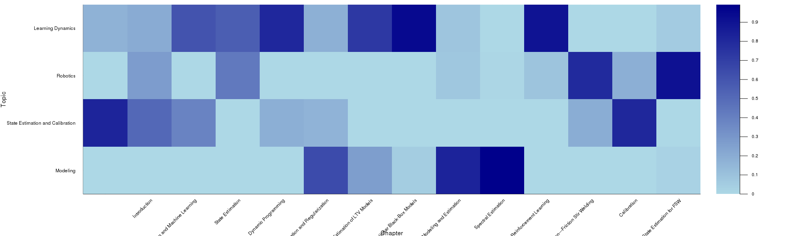

# ThesisTools

[](https://travis-ci.com/baggepinnen/ThesisTools.jl)


# Example usage
```julia
using ThesisTools, TextAnalysis
using TextAnalysis: sentence_tokenize, text
filename                    = "/local/home/fredrikb/phdthesis/phdthesis.tex";
chapters1, headings1        = process(filename, "chapter");
valid_chapter_inds          = length.(chapters1) .> 400;
valid_chapter_inds[[3,16]] .= false;
chapters                    = chapters1[valid_chapter_inds];
headings                    = headings1[valid_chapter_inds];
docs                        = StringDocument.(deepcopy(chapters));
crps                        = Corpus(deepcopy(docs));
prepare!(crps, strip_corrupt_utf8 | strip_case | strip_articles | strip_prepositions | strip_pronouns | strip_stopwords | strip_whitespace | strip_non_letters | strip_numbers)

# stem!(crps)
update_lexicon!(crps)
ϕ,θ,topics = ThesisTools.categorize(crps, 4); # LDA: Latent Dirichlet Allocation, takes about 10 seconds for a 160 page thesis and 4 categories.

julia> topics
30×4 Array{String,2}:
 "model"        "calibration"   "robot"         "model"         
 "friction"     "matrix"        "seam"          "system"        
 "functions"    "methods"       "sensor"        "time"          
 "basis"        "data"          "measurement"   "learning"      
 "function"     "method"        "error"         "models"        
 "estimation"   "estimate"      "filter"        "dynamics"      
 "signal"       "thesis"        "laser"         "function"      
 "parameters"   "using"         "particle"      "optimization"  
 "proposed"     "parameters"    "errors"        "linear"        
 "position"     "linear"        "measurements"  "trajectory"    
 "models"       "plane"         "trajectory"    "data"          
 "spectral"     "sensor"        "uncertainty"   "regularization"
 "temperature"  "set"           "distribution"  "identification"
 "estimated"    "laser"         "forces"        "algorithm"     
 "using"        "system"        "model"         "control"       
 "matrix"       "based"         "estimation"    "jacobian"      
 "method"       "frame"         "gaussian"      "prior"         
 "parameter"    "procedure"     "estimator"     "noise"         
 "velocity"     "algorithm"     "space"         "parameters"    
 "data"         "vector"        "fsw"           "input"         
 "dependence"   "approach"      "tracking"      "methods"       
 "form"         "coordinate"    "forward"       "nonlinear"     
 "due"          "initial"       "process"       "using"         
 "squares"      "flange"        "tool"          "form"          
 "varying"      "machine"       "function"      "optimal"       
 "estimate"     "found"         "sensors"       "systems"       
 "linear"       "kinematic"     "based"         "solution"      
 "methods"      "optimization"  "deflections"   "weight"        
 "dependent"    "research"      "kinematics"    "decay"         
 "motor"        "rotation"      "modeling"      "network"       

julia> topicnames = [ # These have to be manually arranged based on the words appearing in `topcis`
       "Modeling",
       "State Estimation and Calibration",
       "Robotics",
       "Learning Dynamics",
       ];             

julia> using Plots

julia> heatmap(θ, yticks=(1:4, topicnames),xticks=(1:length(headings), headings), ylabel="Topic", xlabel="Chapter", size=(2000,600), color=:blues, xrotation=45);gui()
```

